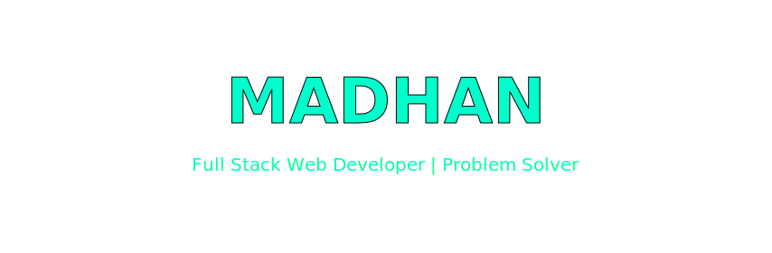
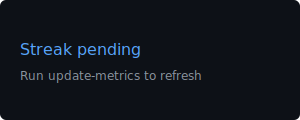

<p align="center">

  </img>
  
</p>


## </img> PROFILE

```bash
> USER        : Madhan
> ROLE        : Web Dev / ML Engineer
> STACK       :  DSA | APIs | DL
> MODE        : Modern ML Development
> STATUS      : Locked In
```


<p align="center"></p>

<p align="center">  </p>


<p align="center"></p>


## 📈 ACTIVITY OVERVIEW

<p align="center">  </p>


<p align="center"></p>

## 📊 GITHUB STATS

<p align="center"> </p> 
<p align="center">  </p> <p align="center">  </p>


<p align="center"></p>

## 🧠 LEETCODE

<p align="center">  </p>


<p align="center"></p>

## 🐍 CONTRIBUTIONS

<p align="center">  </p>


<p align="center"></p>

## 🌐 CONNECT WITH ME

<p align="center"> <a href="https://www.linkedin.com/in/madhan-aturu-174287358/">  </a> <a href="mailto:MadhanReddy.exe@gmail.com">  </a> <a href="">  </a> </p>


<p align="center"></p>

## 📌 CORE VALUES

`+ Learn consistently  + Build useful solutions  + Write clean code  + Improve step by step` 


<p align="center"></p>

<p align="center">  </p> ```